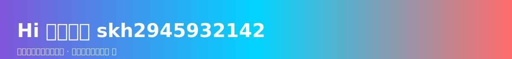

# Hi 👋，我是 天晴风吹过

  <!-- 本地 SVG header（images/header.svg） -->
  

  <!-- 轻量链接按钮 -->
  <a href="docs/index.html" style="text-decoration:none;background:#0b1221;color:#cfe3ff;padding:8px 14px;border-radius:8px;border:1px solid rgba(255,255,255,0.03);">▶️ 在 docs 中打开完整交互演示</a>

  <!-- 复合动画：背景波、变形 blob、渐变进度 -->
  <svg width="100%" height="320" viewBox="0 0 1200 320" xmlns="http://www.w3.org/2000/svg" aria-hidden="true">
    <defs>
      <linearGradient id="gradA" x1="0%" x2="100%">
        <stop offset="0%" stop-color="#7F56D9" />
        <stop offset="50%" stop-color="#00D4FF" />
        <stop offset="100%" stop-color="#FF6B6B" />
      </linearGradient>
      <filter id="fBlur"><feGaussianBlur stdDeviation="20"/></filter>
    </defs>

    <rect width="1200" height="320" fill="#06070a" />

    <g opacity="0.24">
      <rect x="-200" y="40" width="1600" height="120" fill="url(#gradA)">
        <animate attributeName="x" values="-200;0;-200" dur="12s" repeatCount="indefinite"/>
        <animate attributeName="opacity" values="0.18;0.26;0.18" dur="9s" repeatCount="indefinite"/>
      </rect>
      <rect x="-400" y="160" width="1600" height="80" fill="url(#gradA)" opacity="0.12">
        <animate attributeName="x" values="-400;-200;-400" dur="10s" repeatCount="indefinite"/>
        <animate attributeName="opacity" values="0.08;0.14;0.08" dur="8s" repeatCount="indefinite"/>
      </rect>
    </g>

    <!-- 变形 blob（路径插值） -->
    <g transform="translate(300,140)">
      <g filter="url(#fBlur)" opacity="0.9">
        <path id="blob" d="M120,-80 C200,-40 220,40 150,110 C80,180 -20,200 -80,150 C-140,100 -170,30 -130,-30 C-90,-90 40,-120 120,-80Z" fill="url(#gradA)">
          <animate attributeName="d" dur="6s" repeatCount="indefinite"
            values="M120,-80 C200,-40 220,40 150,110 C80,180 -20,200 -80,150 C-140,100 -170,30 -130,-30 C-90,-90 40,-120 120,-80Z;
                    M140,-70 C220,-10 240,60 180,120 C120,180 20,200 -40,160 C-100,120 -150,40 -120,-30 C-90,-100 40,-140 140,-70Z;
                    M120,-80 C200,-40 220,40 150,110 C80,180 -20,200 -80,150 C-140,100 -170,30 -130,-30 C-90,-90 40,-120 120,-80Z"/>
        </path>
      </g>
    </g>

    <!-- 主标题与说明 -->
    <g>
      <text x="560" y="120" font-family="Segoe UI, Roboto, Arial" font-size="28" fill="#f4f8ff" font-weight="700">天晴风吹过</text>
      <text x="560" y="152" font-family="Segoe UI, Roboto" font-size="14" fill="#a6c8ff">纯 SVG 动画：路径变形、渐变移动、进度环。更多交互见 docs/。</text>
    </g>

    <!-- 渐进条（进度 + 悬停变速） -->
    <g transform="translate(520,180)">
      <rect x="0" y="0" width="360" height="12" rx="6" fill="#071123" />
      <rect id="bar" x="0" y="0" width="0" height="12" rx="6" fill="url(#gradA)">
        <animate attributeName="width" from="0" to="360" dur="3.2s" begin="0.4s" fill="freeze"/>
      </rect>
      <text x="372" y="10" font-family="Segoe UI, Roboto" font-size="12" fill="#cfe3ff">交互式预览</text>
    </g>

    <!-- 三个进度环（再现技能条） -->
    <g transform="translate(900,210)">
      <g transform="translate(0,-20)">
        <circle r="26" cx="0" cy="0" fill="#071123" stroke="#0f2a3b" stroke-width="6" />
        <circle r="26" cx="0" cy="0" fill="none" stroke="#7F56D9" stroke-width="6" stroke-linecap="round" stroke-dasharray="163" stroke-dashoffset="163">
          <animate attributeName="stroke-dashoffset" values="163;40" dur="1.6s" begin="0s" fill="freeze"/>
        </circle>
      </g>
      <g transform="translate(70,-20)">
        <circle r="26" cx="0" cy="0" fill="#071123" stroke="#0f2a3b" stroke-width="6" />
        <circle r="26" cx="0" cy="0" fill="none" stroke="#00D4FF" stroke-width="6" stroke-linecap="round" stroke-dasharray="163" stroke-dashoffset="163">
          <animate attributeName="stroke-dashoffset" values="163;70" dur="1.8s" begin="0.2s" fill="freeze"/>
        </circle>
      </g>
      <g transform="translate(140,-20)">
        <circle r="26" cx="0" cy="0" fill="#071123" stroke="#0f2a3b" stroke-width="6" />
        <circle r="26" cx="0" cy="0" fill="none" stroke="#FF6B6B" stroke-width="6" stroke-linecap="round" stroke-dasharray="163" stroke-dashoffset="163">
          <animate attributeName="stroke-dashoffset" values="163;25" dur="2s" begin="0.4s" fill="freeze"/>
        </circle>
      </g>
    </g>

    
  </svg>

